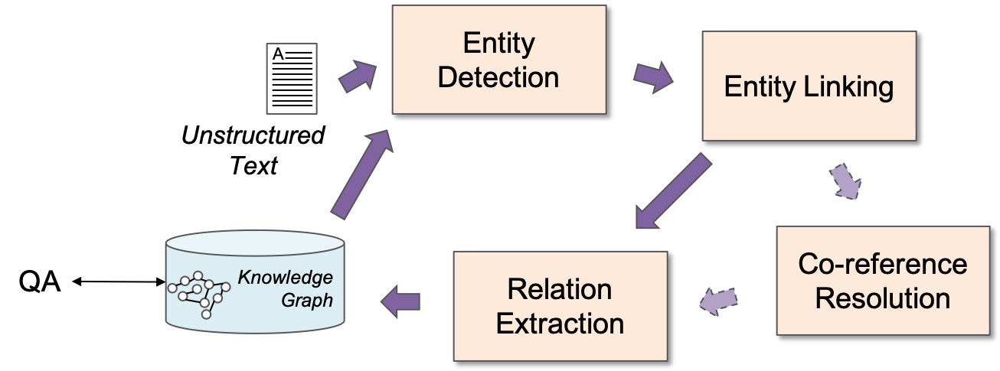

# Crowdsourcing data and Machine learning models for Information Extraction

## About
Effective Crowdsourcing of Multiple Tasks for Comprehensive Information Extraction

## Architecture

## Available dataset
* [Crowdsourcing data and all other resources, such as pretrained embedding](https://figshare.com/)
* [OKBQA KBP Task, Description and sample](https://github.com/machinereading/okbqa-7-task4)

## Machine Learning Models
* [Entity Linking](https://github.com/machinereading/eld-2018)
* [Co-reference resolution](https://github.com/machinereading/CR)
* [Relation Extraction: PCNN and GAN](https://github.com/machinereading/re-gan)
* [Relation Extraction: RL](https://github.com/machinereading/re-RL-Crowd)
* [Relation Extraction: BERT](https://github.com/machinereading/bert-ko-re/)

## External resources
* [KBox](http://kbox.kaist.ac.kr)
* [Korean KBP Demo](https://github.com/machinereading/wisekb-demo)

## Licenses
* `CC BY-NC-SA` [Attribution-NonCommercial-ShareAlike](https://creativecommons.org/licenses/by-nc-sa/2.0/)
* If you want to commercialize this resource, [please contact to us](http://mrlab.kaist.ac.kr/contact)

## Publisher
[Machine Reading Lab](http://mrlab.kaist.ac.kr/) @ KAIST

## Acknowledgement
This work was supported by Institute for Information & communications Technology Promotion(IITP) grant funded by the Korea government(MSIT) (2013-0-00109, WiseKB: Big data based self-evolving knowledge base and reasoning platform)
